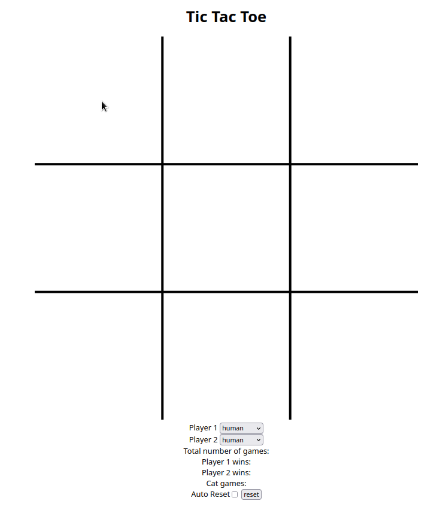

# [Tic-Tac-Toe HTML Canvas and JS](https://pages.github.com)

<picture>
  <source
    srcset="Tic-Tac-Toe.gif"
    media="(prefers-color-scheme: dark)"
  />
  
</picture>

## Description
A simple Tic-Tac-Toe game created with HTML Canvas and JS
 - Easy/Hard CPU as player 1 or 2

Link: https://pages.github.com